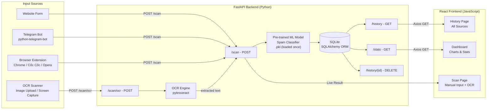

# Spam Detection System - Architecture Plan

## COS30049 - Assignment 3

---

## Team Information

| No. | Name              | Student ID | Role |
| --- | ----------------- | ---------- | ---- |
| 1   | Nguyen Thanh Kien | 105507742  |      |
| 2   | Bui Tien Hung     | 105555411  |      |
| 3   | Truong Nam Hung   | 105556375  |      |
| 4   | Nguyen Huu Hieu   | 104988566  |      |

**Tutor:** TBA  
**Due Date:** Sunday, 10 April 2026 at 17:00 (UTC +7)

---

## Project Overview

A full-stack web application that integrates a **pre-trained** spam detection ML model (trained in Assignment 2, saved as `.pkl`) with a React.js frontend and FastAPI Python backend. Users can submit messages for spam classification through **four input sources**: a website form, a Telegram bot, a **cross-browser extension** (Chrome, Cốc Cốc, Opera), and an **OCR-based image scanner** (screenshot upload or screen capture to extract and detect spam from message images). All results are stored in a SQLite database and displayed on the website with interactive visualizations.

---

## Tech Stack

| Layer             | Technology                        | Purpose                                    |
| ----------------- | --------------------------------- | ------------------------------------------ |
| Frontend          | React.js + Vite                   | User interface                             |
| Styling           | Tailwind CSS                      | Responsive design                          |
| Charts            | Recharts                          | Interactive data visualization             |
| HTTP Client       | Axios                             | Frontend to backend communication          |
| Routing           | React Router v6                   | Multi-page navigation                      |
| Backend           | FastAPI (Python)                   | REST API server                            |
| Database          | SQLite + SQLAlchemy               | Data persistence                           |
| ML Model          | scikit-learn (.pkl) — pre-trained | Spam classification (loaded at startup)    |
| OCR Engine        | Tesseract.js (FE) / pytesseract (BE) | Text extraction from images             |
| Telegram Bot      | python-telegram-bot               | Telegram input source                      |
| Browser Extension | Vanilla JS (Manifest V3)         | Chrome, Cốc Cốc, Opera input source       |

---

## System Architecture



---

## Input Sources

### 1. Website Form

- User pastes or types a message directly into the Scan page
- Frontend validates input before sending to backend
- Result displayed instantly with confidence score and keyword highlights

### 2. Telegram Bot (python-telegram-bot)

- User sends a message to the Telegram bot
- Bot forwards message to FastAPI `/scan` endpoint
- Result is returned to the user on Telegram and stored in SQLite
- Website History page displays all Telegram scans with auto-refresh every 10 seconds

### 3. Browser Extension — Chrome, Cốc Cốc, Opera (Vanilla JS, Manifest V3)

All three browsers are Chromium-based and support the same Manifest V3 extension format. A single codebase is used for all three, with browser-specific installation instructions provided.

- User highlights any text on any webpage
- A small popup appears with a Scan button
- Extension sends highlighted text to FastAPI `/scan` endpoint
- Result shown as inline popup in the browser
- Result also stored in SQLite and visible on the History page

**Supported browsers:**

| Browser  | Engine          | Extension Support | Installation Method                        |
| -------- | --------------- | ----------------- | ------------------------------------------ |
| Chrome   | Chromium (Blink) | Manifest V3      | `chrome://extensions` → Load unpacked      |
| Cốc Cốc | Chromium (Blink) | Manifest V3      | `coccoc://extensions` → Load unpacked      |
| Opera    | Chromium (Blink) | Manifest V3      | `opera://extensions` → Load unpacked       |

### 4. OCR Scanner — Image Upload / Screen Capture (NEW)

Users can scan spam from images (screenshots of messages, chat conversations, SMS, etc.) by uploading an image or capturing a screen region.

**Two capture methods:**

| Method          | Description                                                   |
| --------------- | ------------------------------------------------------------- |
| Image Upload    | User uploads a screenshot (PNG, JPG, WebP) via file picker    |
| Screen Capture  | User captures a region of the screen using browser Screen Capture API |

**OCR processing flow:**

```
User uploads image or captures screen region
        │
        ▼
Frontend sends image to POST /scan/ocr (multipart/form-data)
        │
        ▼
Backend: pytesseract extracts text from image
        │  ┌─ If text found → pass to predict() → return result
        │  └─ If no text found → return error "No text detected"
        ▼
Result displayed on Scan page (same UI as manual input)
        │
        ▼
SQLite stores result with source = "ocr"
```

---

## 1. Front-End Development (React.js)

### 1.1 User Input Form & Validation

The Scan page contains a controlled textarea component with the following validation logic:

| Validation Rule         | Implementation                                                  |
| ----------------------- | --------------------------------------------------------------- |
| Empty input             | Disable submit button; show inline "Message cannot be empty"    |
| Min length (10 chars)   | Warning message shown dynamically as user types                 |
| Max length (2000 chars) | Character counter displayed (e.g., `142 / 2000`); hard cap      |
| Whitespace-only input   | Trimmed before sending; treated same as empty                   |
| Loading state           | Submit button replaced with spinner; input disabled during call |
| Network / server error  | Error toast shown with retry option                             |

**Component:** `ScanForm.jsx`

```jsx
const [message, setMessage] = useState("");
const [error, setError] = useState("");
const [loading, setLoading] = useState(false);

const validate = (text) => {
  if (!text.trim()) return "Message cannot be empty.";
  if (text.trim().length < 10)
    return "Message is too short (min 10 characters).";
  if (text.length > 2000) return "Message exceeds 2000 character limit.";
  return "";
};

const handleChange = (e) => {
  setMessage(e.target.value);
  setError(validate(e.target.value));
};

const handleSubmit = async () => {
  const validationError = validate(message);
  if (validationError) return setError(validationError);
  setLoading(true);
  // POST to /scan ...
};
```

---

### 1.2 OCR Input Component (NEW)

The Scan page also includes an OCR tab/section for image-based spam detection:

**Component:** `OcrScanner.jsx`

```jsx
import { useState, useRef } from "react";
import { scanOcr } from "../services/api";

export default function OcrScanner({ onResult }) {
  const [preview, setPreview] = useState(null);
  const [loading, setLoading] = useState(false);
  const [extractedText, setExtractedText] = useState("");
  const fileInputRef = useRef(null);

  // Method 1: File upload
  const handleFileUpload = (e) => {
    const file = e.target.files[0];
    if (!file) return;
    if (!["image/png", "image/jpeg", "image/webp"].includes(file.type)) {
      alert("Please upload a PNG, JPG, or WebP image.");
      return;
    }
    if (file.size > 5 * 1024 * 1024) {
      alert("Image must be under 5MB.");
      return;
    }
    setPreview(URL.createObjectURL(file));
    submitImage(file);
  };

  // Method 2: Screen capture using Browser Screen Capture API
  const handleScreenCapture = async () => {
    try {
      const stream = await navigator.mediaDevices.getDisplayMedia({
        video: { mediaSource: "screen" },
      });
      const track = stream.getVideoTracks()[0];
      const imageCapture = new ImageCapture(track);
      const bitmap = await imageCapture.grabFrame();
      track.stop();

      // Convert to blob
      const canvas = document.createElement("canvas");
      canvas.width = bitmap.width;
      canvas.height = bitmap.height;
      canvas.getContext("2d").drawImage(bitmap, 0, 0);
      canvas.toBlob((blob) => {
        setPreview(URL.createObjectURL(blob));
        submitImage(blob);
      }, "image/png");
    } catch (err) {
      console.error("Screen capture cancelled or failed:", err);
    }
  };

  const submitImage = async (imageData) => {
    setLoading(true);
    try {
      const formData = new FormData();
      formData.append("image", imageData);
      const res = await scanOcr(formData);
      setExtractedText(res.data.extracted_text);
      onResult(res.data);
    } catch (err) {
      alert("OCR failed: " + (err.response?.data?.detail || err.message));
    } finally {
      setLoading(false);
    }
  };

  return (
    <div className="ocr-scanner">
      <div className="ocr-actions">
        <button onClick={() => fileInputRef.current.click()}>
          📁 Upload Image
        </button>
        <button onClick={handleScreenCapture}>
          📸 Capture Screen
        </button>
        <input
          ref={fileInputRef}
          type="file"
          accept="image/png,image/jpeg,image/webp"
          onChange={handleFileUpload}
          hidden
        />
      </div>
      {preview && }
      {loading && <p>🔄 Extracting text and scanning...</p>}
      {extractedText && (
        <div className="extracted-text">
          <h4>Extracted Text:</h4>
          <p>{extractedText}</p>
        </div>
      )}
    </div>
  );
}
```

---

### 1.3 Data Visualization (3 Charts — HD Level)

All charts are implemented using **Recharts** and are interactive with hover tooltips, legends, and responsive containers.

#### Chart 1: Donut Chart — Spam vs Ham Ratio (Dashboard)

- Displays the proportion of spam and ham across all scans
- Color: red for spam, green for ham
- Center label shows total scans
- Tooltip shows count + percentage on hover

```jsx
import { PieChart, Pie, Cell, Tooltip, Legend } from "recharts";

const data = [
  { name: "Spam", value: spamCount },
  { name: "Ham", value: hamCount },
];
const COLORS = ["#ef4444", "#22c55e"];

<PieChart>
  <Pie data={data} innerRadius={60} outerRadius={100} dataKey="value">
    {data.map((_, i) => (
      <Cell key={i} fill={COLORS[i]} />
    ))}
  </Pie>
  <Tooltip />
  <Legend />
</PieChart>;
```

#### Chart 2: Line Chart — Daily Scan Activity (Dashboard)

- X-axis: date (last 14 days)
- Y-axis: number of scans
- Two lines: total scans and spam-only scans
- Tooltip shows breakdown per day

```jsx
import {
  LineChart,
  Line,
  XAxis,
  YAxis,
  CartesianGrid,
  Tooltip,
  Legend,
} from "recharts";

<LineChart data={dailyStats}>
  <CartesianGrid strokeDasharray="3 3" />
  <XAxis dataKey="date" />
  <YAxis />
  <Tooltip />
  <Legend />
  <Line type="monotone" dataKey="total" stroke="#6366f1" />
  <Line type="monotone" dataKey="spam" stroke="#ef4444" />
</LineChart>;
```

#### Chart 3: Bar Chart — Confidence Score Distribution (Dashboard)

- X-axis: confidence buckets (0–20%, 20–40%, ..., 80–100%)
- Y-axis: number of scans in each bucket
- Stacked bars: spam (red) and ham (green)
- Helps visualize model certainty across results

```jsx
import {
  BarChart,
  Bar,
  XAxis,
  YAxis,
  CartesianGrid,
  Tooltip,
  Legend,
} from "recharts";

<BarChart data={confidenceBuckets}>
  <CartesianGrid strokeDasharray="3 3" />
  <XAxis dataKey="range" />
  <YAxis />
  <Tooltip />
  <Legend />
  <Bar dataKey="spam" fill="#ef4444" stackId="a" />
  <Bar dataKey="ham" fill="#22c55e" stackId="a" />
</BarChart>;
```

---

### 1.4 Responsive Interface Design

Tailwind CSS breakpoints are used to ensure the layout adapts to all screen sizes:

| Breakpoint | Layout Behavior                                 |
| ---------- | ----------------------------------------------- |
| Mobile     | Single-column stack; charts scale to full width |
| Tablet     | 2-column grid for summary cards; charts below   |
| Desktop    | 3-column card grid; charts side by side         |

Key responsive patterns:

- `grid grid-cols-1 md:grid-cols-2 lg:grid-cols-3` for summary cards
- `<ResponsiveContainer width="100%" height={300}>` wraps all Recharts components
- Navbar collapses to hamburger menu on mobile

---

### 1.5 Backend API Communication (Axios)

All API calls are centralized in `src/services/api.js` using an Axios instance with a base URL, timeout, and response interceptors.

```js
// services/api.js
import axios from "axios";

const api = axios.create({
  baseURL: "http://localhost:8000",
  timeout: 10000,
});

// Response interceptor for global error handling
api.interceptors.response.use(
  (res) => res,
  (err) => {
    console.error("API error:", err.response?.data || err.message);
    return Promise.reject(err);
  },
);

export const scanMessage = (message, source) =>
  api.post("/scan", { message, source });

export const scanOcr = (formData) =>
  api.post("/scan/ocr", formData, {
    headers: { "Content-Type": "multipart/form-data" },
  });

export const getHistory = (page = 1, limit = 20, filter = "", source = "") =>
  api.get("/history", { params: { page, limit, filter, source } });

export const getStats = () => api.get("/stats");

export const deleteRecord = (id) => api.delete(`/history/${id}`);
```

---

### 1.6 UI/UX Principles

| Principle              | Implementation Detail                                                         |
| ---------------------- | ----------------------------------------------------------------------------- |
| Feedback               | Loading spinners on submit, toast notifications for success/error             |
| Clarity                | Color-coded result cards (red = spam, green = ham) with confidence percentage |
| Efficiency             | Keyword highlights on scan results pinpoint suspicious tokens                 |
| Accessibility          | Semantic HTML elements; sufficient color contrast; aria-labels on buttons     |
| Error prevention       | Inline validation on the form prevents bad submissions                        |
| Consistency            | Shared color palette, spacing, and typography via Tailwind config             |
| Progressive disclosure | Message preview truncated at 100 chars in History table; click to expand      |

---

## 2. Back-End Development (FastAPI)

### 2.1 FastAPI Server Setup

The application entry point is `backend/main.py`. CORS is enabled to allow the React dev server (port 5173) and browser extensions (Chrome, Cốc Cốc, Opera) to communicate with the API (port 8000).

```python
# main.py
from fastapi import FastAPI
from fastapi.middleware.cors import CORSMiddleware
from routes import scan, history, stats
from database.database import Base, engine

Base.metadata.create_all(bind=engine)

app = FastAPI(title="Spam Detection API", version="1.0.0")

app.add_middleware(
    CORSMiddleware,
    allow_origins=[
        "http://localhost:5173",
        "chrome-extension://*",     # Chrome
        "chrome-extension://*",     # Cốc Cốc (Chromium-based, same origin scheme)
        "chrome-extension://*",     # Opera (Chromium-based, same origin scheme)
    ],
    allow_credentials=True,
    allow_methods=["*"],
    allow_headers=["*"],
)

app.include_router(scan.router)
app.include_router(history.router)
app.include_router(stats.router)
```

> **Note:** Cốc Cốc and Opera both use the `chrome-extension://` origin scheme because they are Chromium-based. No additional CORS configuration is needed beyond what Chrome already requires.

---

### 2.2 API Endpoints (5 HTTP Methods Used)

| Endpoint        | Method   | Description                          | Request Body / Params           | Response                                            |
| --------------- | -------- | ------------------------------------ | ------------------------------- | --------------------------------------------------- |
| `/scan`         | `POST`   | Scan a text message and store result | `{ message: str, source: str }` | `{ result, confidence, keywords, id }`              |
| `/scan/ocr`     | `POST`   | Upload image → OCR → scan text       | `multipart/form-data (image)`   | `{ result, confidence, keywords, id, extracted_text }` |
| `/history`      | `GET`    | Return paginated scan history        | `?page&limit&filter&source`     | `{ data: [...], total: int, page: int }`            |
| `/stats`        | `GET`    | Return aggregated chart data         | None                            | `{ spam_count, ham_count, daily_stats, buckets }`   |
| `/history/{id}` | `DELETE` | Delete a specific scan record        | Path param `id`                 | `{ success: true }`                                 |

#### POST /scan — Route Implementation

```python
# routes/scan.py
from fastapi import APIRouter, Depends, HTTPException
from pydantic import BaseModel, validator
from sqlalchemy.orm import Session
from database.database import get_db
from database.schema import Scan
from ml.predictor import predict

router = APIRouter()

class ScanRequest(BaseModel):
    message: str
    source: str  # "website", "telegram", "extension", "ocr"

    @validator("message")
    def message_not_empty(cls, v):
        if not v.strip():
            raise ValueError("Message cannot be empty")
        if len(v.strip()) < 10:
            raise ValueError("Message too short")
        return v.strip()

@router.post("/scan")
def scan_message(req: ScanRequest, db: Session = Depends(get_db)):
    try:
        result, confidence, keywords = predict(req.message)
        record = Scan(
            message=req.message,
            result=result,
            confidence=round(confidence, 4),
            source=req.source,
            keywords=",".join(keywords),
        )
        db.add(record)
        db.commit()
        db.refresh(record)
        return {"result": result, "confidence": confidence, "keywords": keywords, "id": record.id}
    except Exception as e:
        raise HTTPException(status_code=500, detail=str(e))
```

#### POST /scan/ocr — OCR Route Implementation (NEW)

```python
# routes/scan.py (additional endpoint)
from fastapi import UploadFile, File
import pytesseract
from PIL import Image
import io

@router.post("/scan/ocr")
async def scan_ocr(image: UploadFile = File(...), db: Session = Depends(get_db)):
    # Validate file type
    if image.content_type not in ["image/png", "image/jpeg", "image/webp"]:
        raise HTTPException(status_code=400, detail="Only PNG, JPG, WebP images are supported.")

    # Read and process image
    contents = await image.read()
    if len(contents) > 5 * 1024 * 1024:  # 5MB limit
        raise HTTPException(status_code=400, detail="Image must be under 5MB.")

    try:
        img = Image.open(io.BytesIO(contents))
        extracted_text = pytesseract.image_to_string(img).strip()
    except Exception as e:
        raise HTTPException(status_code=500, detail=f"OCR processing failed: {str(e)}")

    if not extracted_text or len(extracted_text) < 10:
        raise HTTPException(status_code=422, detail="No sufficient text detected in the image.")

    # Run through the same predict pipeline
    result, confidence, keywords = predict(extracted_text)
    record = Scan(
        message=extracted_text,
        result=result,
        confidence=round(confidence, 4),
        source="ocr",
        keywords=",".join(keywords),
    )
    db.add(record)
    db.commit()
    db.refresh(record)

    return {
        "result": result,
        "confidence": confidence,
        "keywords": keywords,
        "id": record.id,
        "extracted_text": extracted_text,
    }
```

#### GET /history — Route Implementation

```python
# routes/history.py
from fastapi import APIRouter, Depends, Query
from sqlalchemy.orm import Session
from database.database import get_db
from database.schema import Scan

router = APIRouter()

@router.get("/history")
def get_history(
    page: int = Query(1, ge=1),
    limit: int = Query(20, le=100),
    filter: str = Query(""),       # "spam" | "ham" | ""
    source: str = Query(""),       # "website" | "telegram" | "extension" | "ocr" | ""
    db: Session = Depends(get_db)
):
    query = db.query(Scan)
    if filter in ("spam", "ham"):
        query = query.filter(Scan.result == filter)
    if source in ("website", "telegram", "extension", "ocr"):
        query = query.filter(Scan.source == source)
    total = query.count()
    data = query.order_by(Scan.timestamp.desc()).offset((page - 1) * limit).limit(limit).all()
    return {"data": data, "total": total, "page": page}

@router.delete("/history/{record_id}")
def delete_record(record_id: int, db: Session = Depends(get_db)):
    record = db.query(Scan).filter(Scan.id == record_id).first()
    if not record:
        raise HTTPException(status_code=404, detail="Record not found")
    db.delete(record)
    db.commit()
    return {"success": True}
```

---

### 2.3 Error Handling & Exception Management

All routes use structured error responses. FastAPI's exception handler is registered globally:

```python
# main.py (additional)
from fastapi import Request
from fastapi.responses import JSONResponse

@app.exception_handler(Exception)
async def global_exception_handler(request: Request, exc: Exception):
    return JSONResponse(
        status_code=500,
        content={"detail": f"Internal server error: {str(exc)}"},
    )

@app.exception_handler(404)
async def not_found_handler(request: Request, exc):
    return JSONResponse(status_code=404, content={"detail": "Resource not found"})
```

Error scenarios handled:

| Scenario                        | HTTP Status | Response Detail                   |
| ------------------------------- | ----------- | --------------------------------- |
| Empty or too-short message      | 422         | Pydantic validation error message |
| Record not found on DELETE      | 404         | "Record not found"                |
| ML model file missing / corrupt | 500         | "Model loading failed"            |
| DB write failure                | 500         | SQLAlchemy error surfaced safely  |
| Invalid source value            | 422         | Pydantic validation error         |
| Invalid image format (OCR)      | 400         | "Only PNG, JPG, WebP supported"   |
| Image too large (OCR)           | 400         | "Image must be under 5MB"         |
| No text detected in image (OCR) | 422         | "No sufficient text detected"     |
| OCR engine failure              | 500         | "OCR processing failed"           |

---

## 3. AI Model Integration

### 3.1 Pre-Trained Model — Loading & Efficient Execution

The spam classifier model was **already trained in Assignment 2** using scikit-learn. The trained pipeline (TF-IDF vectorizer + classifier) is saved as a `.pkl` file and is **loaded once at application startup** — not re-loaded per request — to ensure fast inference.

> **Key point:** No model training happens in this application. The `.pkl` file from Assignment 2 is used as-is. This application only performs **inference** (prediction) on new input messages.

```python
# ml/predictor.py
import pickle
import re
from contextlib import asynccontextmanager
from fastapi import FastAPI

_model = None

def load_model():
    """Load the pre-trained model from Assignment 2 (.pkl file) into memory."""
    global _model
    with open("models/spam_classifier.pkl", "rb") as f:
        _model = pickle.load(f)

@asynccontextmanager
async def lifespan(app: FastAPI):
    load_model()       # Startup: load pre-trained model into memory once
    yield
    _model = None      # Shutdown: release

app = FastAPI(lifespan=lifespan)
```

---

### 3.2 Data Preprocessing

Before inference, the raw input message is preprocessed to match the format used during model training in Assignment 2:

```python
# ml/predictor.py
import re

SPAM_KEYWORDS = ["free", "win", "winner", "click", "prize", "urgent", "claim", "offer", "discount", "cash"]

def preprocess(text: str) -> str:
    text = text.lower()
    text = re.sub(r"http\S+|www\S+", " url ", text)    # Replace URLs
    text = re.sub(r"\d+", " num ", text)                # Replace numbers
    text = re.sub(r"[^\w\s]", " ", text)                # Remove punctuation
    text = re.sub(r"\s+", " ", text).strip()            # Normalize whitespace
    return text

def extract_keywords(text: str) -> list[str]:
    """Return spam-indicative words found in the original message."""
    lower = text.lower()
    return [kw for kw in SPAM_KEYWORDS if kw in lower]
```

---

### 3.3 Inference & Postprocessing

The `predict()` function wraps preprocessing, model inference, and postprocessing into a single callable used by both `/scan` and `/scan/ocr` routes:

```python
def predict(raw_text: str) -> tuple[str, float, list[str]]:
    """Run inference using the pre-trained model from Assignment 2."""
    if _model is None:
        raise RuntimeError("Model not loaded.")

    cleaned = preprocess(raw_text)

    # The pre-trained pipeline includes TF-IDF vectorizer + classifier
    proba = _model.predict_proba([cleaned])[0]
    spam_confidence = float(proba[1])               # Index 1 = spam class
    result = "spam" if spam_confidence >= 0.5 else "ham"

    keywords = extract_keywords(raw_text)

    return result, spam_confidence, keywords
```

**Postprocessing notes:**

- Confidence score is rounded to 4 decimal places before storing
- `keywords` list is joined with commas for DB storage and split back on retrieval
- If `predict_proba` is unavailable (some models), fall back to `decision_function` normalized with sigmoid

---

## 4. Data Connection: Telegram + Browser Extension + OCR → Web App (Local)

### 4.1 Telegram Bot → FastAPI → Database → Web App

The flow for Telegram data reaching the web app:

```
User sends message to Telegram Bot
        │
        ▼
python-telegram-bot listener (bot/telegram_bot.py)
        │  POST http://localhost:8000/scan
        │  { "message": "...", "source": "telegram", "username": "..." }
        ▼
FastAPI /scan endpoint
        │  Pre-trained ML model predicts + stores in SQLite
        ▼
SQLite DB (scans table)
        │
        ▼
React History page polls GET /history every 10s (auto-refresh)
        │  Axios: api.get("/history")
        ▼
Table updates with new Telegram row (source tag = "telegram")
```

**Telegram bot implementation (`bot/telegram_bot.py`):**

```python
import requests
from telegram import Update
from telegram.ext import ApplicationBuilder, MessageHandler, filters, ContextTypes

FASTAPI_URL = "http://localhost:8000/scan"
BOT_TOKEN = "YOUR_BOT_TOKEN_HERE"   # From @BotFather

async def handle_message(update: Update, context: ContextTypes.DEFAULT_TYPE):
    text = update.message.text
    username = update.effective_user.username or "unknown"

    try:
        response = requests.post(FASTAPI_URL, json={
            "message": text,
            "source": "telegram",
            "username": username,
        }, timeout=10)
        data = response.json()

        label = data["result"].upper()
        conf = round(data["confidence"] * 100, 1)
        keywords = ", ".join(data["keywords"]) if data["keywords"] else "none"

        await update.message.reply_text(
            f"🔍 Result: *{label}*\n"
            f"📊 Confidence: {conf}%\n"
            f"🚩 Keywords: {keywords}",
            parse_mode="Markdown"
        )
    except Exception as e:
        await update.message.reply_text(f"⚠️ Error: {str(e)}")

if __name__ == "__main__":
    app = ApplicationBuilder().token(BOT_TOKEN).build()
    app.add_handler(MessageHandler(filters.TEXT & ~filters.COMMAND, handle_message))
    app.run_polling()
```

**Running locally:**

```bash
# Terminal 1 — Start FastAPI
cd backend
uvicorn main:app --reload --port 8000

# Terminal 2 — Start Telegram bot
cd backend
python bot/telegram_bot.py

# Terminal 3 — Start React frontend
cd frontend
npm run dev
```

---

### 4.2 Browser Extension (Chrome / Cốc Cốc / Opera) → FastAPI → Database → Web App

Since Chrome, Cốc Cốc, and Opera are all Chromium-based, the same extension code works across all three browsers with no modifications.

**Data flow:**

```
User highlights text on any webpage (Chrome / Cốc Cốc / Opera)
        │  content.js detects selection
        ▼
Floating popup appears with "Scan" button
        │
        ▼
popup.js sends POST to http://localhost:8000/scan
        │  { "message": "highlighted text", "source": "extension" }
        ▼
FastAPI stores in SQLite, returns result
        │
        ▼
Inline popup in browser shows spam/ham + confidence
        │
        ▼
React History page auto-refreshes and shows extension result
```

**`content.js` — Text highlight detection:**

```javascript
// content.js
document.addEventListener("mouseup", () => {
  const selectedText = window.getSelection().toString().trim();
  if (selectedText.length > 10) {
    // Remove existing popup
    document.getElementById("spam-detector-popup")?.remove();

    const popup = document.createElement("div");
    popup.id = "spam-detector-popup";
    popup.innerHTML = `
      <p style="margin:0 0 6px;font-size:13px;">"${selectedText.slice(0, 60)}..."</p>
      <button id="scan-btn" style="background:#6366f1;color:#fff;border:none;padding:6px 12px;border-radius:4px;cursor:pointer;">
        🔍 Scan for Spam
      </button>
      <span id="scan-result" style="display:none;margin-left:8px;font-weight:bold;"></span>
    `;
    popup.style.cssText = `
      position:fixed;top:20px;right:20px;z-index:99999;
      background:#fff;border:1px solid #ccc;border-radius:8px;
      padding:12px;box-shadow:0 4px 12px rgba(0,0,0,0.15);
      font-family:sans-serif;max-width:280px;
    `;
    document.body.appendChild(popup);

    document.getElementById("scan-btn").addEventListener("click", async () => {
      const btn = document.getElementById("scan-btn");
      btn.textContent = "Scanning...";
      btn.disabled = true;

      try {
        const res = await fetch("http://localhost:8000/scan", {
          method: "POST",
          headers: { "Content-Type": "application/json" },
          body: JSON.stringify({ message: selectedText, source: "extension" }),
        });
        const data = await res.json();

        const resultEl = document.getElementById("scan-result");
        resultEl.style.display = "inline";
        resultEl.style.color = data.result === "spam" ? "#ef4444" : "#22c55e";
        resultEl.textContent = `${data.result.toUpperCase()} (${(data.confidence * 100).toFixed(1)}%)`;
        btn.style.display = "none";
      } catch (e) {
        document.getElementById("scan-result").textContent =
          "Error connecting to server";
      }
    });
  }
});
```

**`manifest.json`:**

```json
{
  "manifest_version": 3,
  "name": "Spam Detector",
  "version": "1.0",
  "description": "Detect spam in selected text using ML — works on Chrome, Cốc Cốc, and Opera",
  "permissions": ["activeTab", "scripting"],
  "host_permissions": ["http://localhost:8000/*"],
  "content_scripts": [
    {
      "matches": ["<all_urls>"],
      "js": ["content.js"]
    }
  ]
}
```

**Installing the extension on each browser:**

| Browser  | Steps                                                                                                     |
| -------- | --------------------------------------------------------------------------------------------------------- |
| Chrome   | Open `chrome://extensions` → Enable **Developer Mode** → Click **Load unpacked** → Select `browser-extension/` folder |
| Cốc Cốc | Open `coccoc://extensions` → Enable **Developer Mode** → Click **Load unpacked** → Select `browser-extension/` folder |
| Opera    | Open `opera://extensions` → Enable **Developer Mode** → Click **Load unpacked** → Select `browser-extension/` folder  |

---

### 4.3 OCR Scanner → FastAPI → Database → Web App (NEW)

**Data flow:**

```
User uploads screenshot or captures screen region on Scan page
        │
        ▼
Frontend sends image to POST /scan/ocr (multipart/form-data)
        │
        ▼
Backend: pytesseract extracts text from image (OCR)
        │  extracted_text = pytesseract.image_to_string(img)
        ▼
Extracted text passed to predict() — same pre-trained model
        │  Result + confidence + keywords
        ▼
SQLite DB (scans table, source = "ocr")
        │
        ▼
React Scan page shows: extracted text + spam/ham result + confidence
        │
        ▼
History page shows OCR results with source tag = "ocr"
```

**OCR setup requirements:**

```bash
# Install Tesseract OCR engine on the system
# Windows: Download installer from https://github.com/UB-Mannheim/tesseract/wiki
# macOS: brew install tesseract
# Linux: sudo apt install tesseract-ocr

# Python dependency
pip install pytesseract Pillow
```

---

### 4.4 Auto-Refresh on History Page

The React History page polls `/history` every 10 seconds to surface new results from Telegram, the browser extension, and OCR scans without requiring a manual page refresh.

```jsx
// pages/History.jsx
import { useEffect, useState, useRef } from "react";
import { getHistory } from "../services/api";

const POLL_INTERVAL = 10000; // 10 seconds

export default function History() {
  const [records, setRecords] = useState([]);
  const intervalRef = useRef(null);

  const fetchHistory = async () => {
    const res = await getHistory(page, 20, filterResult, filterSource);
    setRecords(res.data.data);
  };

  useEffect(() => {
    fetchHistory();
    intervalRef.current = setInterval(fetchHistory, POLL_INTERVAL);
    return () => clearInterval(intervalRef.current); // Cleanup on unmount
  }, [page, filterResult, filterSource]);

  // ... rest of component
}
```

---

## Backend API Endpoints (Summary)

| Endpoint        | Method   | Description                            | Request Body                    | Response                                            |
| --------------- | -------- | -------------------------------------- | ------------------------------- | --------------------------------------------------- |
| `/scan`         | `POST`   | Scan a text message and store result   | `{ message, source }`           | `{ result, confidence, keywords, id }`              |
| `/scan/ocr`     | `POST`   | Upload image → OCR → scan and store    | `multipart/form-data (image)`   | `{ result, confidence, keywords, id, extracted_text }` |
| `/history`      | `GET`    | Return paginated scan history          | `?page=1&limit=20&filter=spam`  | `{ data, total, page }`                             |
| `/stats`        | `GET`    | Return aggregated data for charts      | None                            | `{ spam_count, ham_count, daily_stats }`             |
| `/history/{id}` | `DELETE` | Delete a specific scan record          | None                            | `{ success }`                                       |

---

## Frontend Pages

### Dashboard

- Summary cards: total scanned, spam count, ham count, spam rate percentage
- Chart 1: Donut chart — spam vs ham ratio
- Chart 2: Line chart — scan activity over time (per day)
- Chart 3: Bar chart — confidence score distribution
- All charts interactive with hover tooltips

### Scan Page

- **Tab 1: Text Input** — text input form with character validation
- **Tab 2: OCR Scanner** — upload image or capture screen for text extraction
- Submit button with loading state
- Result card showing spam/ham label, confidence score, and highlighted suspicious keywords
- Source tag on each result (website, Telegram, extension, or OCR)
- For OCR: displays extracted text alongside the scan result

### History Page

- Paginated table showing 20 rows per page
- Columns: timestamp, source, message preview, result, confidence score
- Filter by result (spam/ham) and source (website/Telegram/extension/OCR)
- Sort by date
- Auto-refresh every 10 seconds
- Export history as CSV

---

## Database Schema

### Table: `scans`

| Column     | Type                | Description                              |
| ---------- | ------------------- | ---------------------------------------- |
| id         | INTEGER PRIMARY KEY | Auto-increment ID                        |
| message    | TEXT                | Original message content (or OCR text)   |
| result     | TEXT                | spam or ham                              |
| confidence | FLOAT               | Model confidence score (0.0 to 1.0)      |
| source     | TEXT                | website, telegram, extension, or ocr     |
| username   | TEXT                | Telegram username (if applicable)        |
| keywords   | TEXT                | Comma-separated spam keywords found      |
| timestamp  | DATETIME            | Time of scan                             |

---

## Project Folder Structure

```
project-root/
│
├── backend/                        # FastAPI Python backend
│   ├── main.py                     # FastAPI app entry point + CORS + lifespan
│   ├── ml/
│   │   ├── predictor.py            # load_model(), preprocess(), predict()
│   │   └── spam_classifier.pkl     # Pre-trained ML model from Assignment 2
│   ├── routes/
│   │   ├── scan.py                 # POST /scan + POST /scan/ocr (OCR endpoint)
│   │   ├── history.py              # GET /history, DELETE /history/{id}
│   │   └── stats.py                # GET /stats
│   ├── database/
│   │   ├── database.py             # SQLAlchemy engine + session + get_db
│   │   └── schema.py               # Scan ORM model
│   ├── bot/
│   │   └── telegram_bot.py         # python-telegram-bot → POST /scan
│   ├── requirements.txt
│   └── README.md
│
├── frontend/                       # React.js frontend
│   ├── src/
│   │   ├── pages/
│   │   │   ├── Dashboard.jsx       # 3 charts + summary cards
│   │   │   ├── Scan.jsx            # Text input + OCR scanner tabs + result card
│   │   │   └── History.jsx         # Paginated table + auto-refresh + CSV export
│   │   ├── components/
│   │   │   ├── Navbar.jsx
│   │   │   ├── SummaryCards.jsx
│   │   │   ├── Charts/
│   │   │   │   ├── DonutChart.jsx
│   │   │   │   ├── LineChart.jsx
│   │   │   │   └── BarChart.jsx
│   │   │   ├── ScanForm.jsx        # Controlled textarea + validation
│   │   │   ├── OcrScanner.jsx      # Image upload + screen capture + OCR
│   │   │   ├── ResultCard.jsx      # Spam/ham + confidence + keywords
│   │   │   └── HistoryTable.jsx
│   │   ├── services/
│   │   │   └── api.js              # Axios instance + all API call functions
│   │   ├── App.jsx
│   │   └── main.jsx
│   ├── package.json
│   └── index.html
│
└── browser-extension/              # Cross-browser Extension (Chrome / Cốc Cốc / Opera)
    ├── manifest.json               # Manifest V3; works on all Chromium browsers
    ├── content.js                  # Text highlight detection + inline popup
    └── background.js
```

---

## HD Features Checklist

- [ ] 3 interactive charts with hover tooltips (Dashboard)
- [ ] Four input sources: website form, Telegram bot, browser extension, OCR scanner
- [ ] Browser extension works on Chrome, Cốc Cốc, and Opera
- [ ] OCR: image upload + screen capture to extract and scan text
- [ ] Pagination with filter and sort on History table
- [ ] Confidence score displayed per result
- [ ] Source tagging per result (website / Telegram / extension / OCR)
- [ ] Auto-refresh every 10 seconds on History page
- [ ] Export history as CSV
- [ ] Responsive design (desktop, tablet, mobile)
- [ ] Input validation with dynamic feedback on Scan form
- [ ] Keyword highlighting on scan results
- [ ] Message preview truncation with click-to-expand in History table
- [ ] Global error handling on backend (HTTP 400 / 422 / 404 / 500)
- [ ] Pre-trained model loaded once at startup (not per request, no training in app)

---

## 23-Day Development Timeline

| Days     | Date Range      | Task                                                                                | Assigned To |
| -------- | --------------- | ----------------------------------------------------------------------------------- | ----------- |
| 1 to 2   | Mar 18 to 19    | Project setup, folder structure, FastAPI skeleton + CORS                            |             |
| 3 to 5   | Mar 20 to 22    | FastAPI endpoints + SQLite schema + load pre-trained ML model (.pkl)                |             |
| 4 to 5   | Mar 21 to 22    | Telegram bot → POST /scan + test end-to-end locally                                 |             |
| 6 to 10  | Mar 23 to 27    | React frontend — all 3 pages + Axios service layer + OCR scanner component          |             |
| 11 to 13 | Mar 28 to 30    | 3 Recharts charts + auto-refresh + CSV export                                       |             |
| 14 to 16 | Mar 31 to Apr 2 | Browser extension (content.js + manifest) + test on Chrome, Cốc Cốc, Opera         |             |
| 15 to 16 | Apr 1 to 2      | OCR endpoint (pytesseract) + frontend image upload / screen capture integration     |             |
| 17 to 19 | Apr 3 to 5      | Testing, error handling, responsive polish, validation edge cases                   |             |
| 20 to 21 | Apr 6 to 7      | Report and README                                                                   |             |
| 22 to 23 | Apr 8 to 10     | Demo video and final submission                                                     |             |

---

## Known Challenges and Mitigations

| Challenge                                     | Severity | Mitigation                                            |
| --------------------------------------------- | -------- | ----------------------------------------------------- |
| Database grows too large                      | Low      | Limit history query to latest 500 rows                |
| Too many rows in UI                           | Medium   | Pagination at 20 rows per page                        |
| Polling load on server                        | Low      | Poll every 10 to 15 seconds only                      |
| Long messages breaking layout                 | Medium   | Truncate preview to 100 characters                    |
| Privacy of stored messages                    | Low      | Note as limitation in report                          |
| Browser extension CORS to localhost           | Medium   | Set `host_permissions` in manifest + allow in FastAPI  |
| Cốc Cốc / Opera extension compatibility      | Low      | All Chromium-based; same Manifest V3 format           |
| Telegram bot and FastAPI running at same time | Low      | Run in separate terminals; document in README         |
| Model confidence on unseen text               | Medium   | Display confidence prominently; caveat in report      |
| OCR accuracy on low-quality images            | Medium   | Show extracted text for user verification; min text threshold |
| Tesseract not installed on system             | Medium   | Document installation steps in README; check at startup |
| Large image uploads                           | Low      | Limit to 5MB; validate file type on frontend + backend |

---

_Last updated: 18 March 2026_
