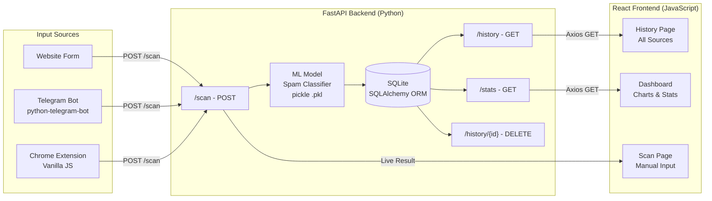

# Spam Detection System - Architecture Plan

## COS30049 - Assignment 3

---

## Team Information

| No. | Name              | Student ID | Role |
| --- | ----------------- | ---------- | ---- |
| 1   | Nguyen Thanh Kien | 105507742  |      |
| 2   | Bui Tien Hung     | 105555411  |      |
| 3   | Truong Nam Hung   | 105556375  |      |
| 4   | Nguyen Huu Hieu   | 104988566  |      |

**Tutor:** TBA  
**Due Date:** Sunday, 10 April 2026 at 17:00 (UTC +7)

---

## Project Overview

A full-stack web application that integrates a trained spam detection ML model (Assignment 2) with a React.js frontend and FastAPI Python backend. Users can submit messages for spam classification through three input sources: a website form, a Telegram bot, and a Chrome extension. All results are stored in a SQLite database and displayed on the website with interactive visualizations.

---

## Tech Stack

| Layer            | Technology          | Purpose                           |
| ---------------- | ------------------- | --------------------------------- |
| Frontend         | React.js + Vite     | User interface                    |
| Styling          | Tailwind CSS        | Responsive design                 |
| Charts           | Recharts            | Interactive data visualization    |
| HTTP Client      | Axios               | Frontend to backend communication |
| Routing          | React Router v6     | Multi-page navigation             |
| Backend          | FastAPI (Python)    | REST API server                   |
| Database         | SQLite + SQLAlchemy | Data persistence                  |
| ML Model         | scikit-learn (.pkl) | Spam classification               |
| Telegram Bot     | python-telegram-bot | Telegram input source             |
| Chrome Extension | Vanilla JS          | Browser input source              |

---

## System Architecture



---

## Input Sources

### 1. Website Form

- User pastes or types a message directly into the Scan page
- Frontend validates input before sending to backend
- Result displayed instantly with confidence score and keyword highlights

### 2. Telegram Bot (python-telegram-bot)

- User sends a message to the Telegram bot
- Bot forwards message to FastAPI `/scan` endpoint
- Result is returned to the user on Telegram and stored in SQLite
- Website History page displays all Telegram scans with auto-refresh every 10 seconds

### 3. Chrome Extension (Vanilla JS)

- User highlights any text on any webpage
- A small popup appears with a Scan button
- Extension sends highlighted text to FastAPI `/scan` endpoint
- Result shown as inline popup in the browser
- Result also stored in SQLite and visible on the History page

---

## Backend API Endpoints

| Endpoint        | Method | Description                       | Request Body                   | Response                                 |
| --------------- | ------ | --------------------------------- | ------------------------------ | ---------------------------------------- |
| `/scan`         | POST   | Scan a message and store result   | `{ message, source }`          | `{ result, confidence, keywords }`       |
| `/history`      | GET    | Return paginated scan history     | `?page=1&limit=20&filter=spam` | `{ data, total, page }`                  |
| `/stats`        | GET    | Return aggregated data for charts | None                           | `{ spam_count, ham_count, daily_stats }` |
| `/history/{id}` | DELETE | Delete a specific scan record     | None                           | `{ success }`                            |

---

## Frontend Pages

### Dashboard

- Summary cards: total scanned, spam count, ham count, spam rate percentage
- Chart 1: Donut chart — spam vs ham ratio
- Chart 2: Line chart — scan activity over time (per day)
- Chart 3: Bar chart — confidence score distribution
- All charts interactive with hover tooltips

### Scan Page

- Text input form with character validation
- Submit button with loading state
- Result card showing spam/ham label, confidence score, and highlighted suspicious keywords
- Source tag on each result (website, Telegram, or extension)

### History Page

- Paginated table showing 20 rows per page
- Columns: timestamp, source, message preview, result, confidence score
- Filter by result (spam/ham) and source (website/Telegram/extension)
- Sort by date
- Auto-refresh every 10 seconds
- Export history as CSV

---

## Database Schema

### Table: `scans`

| Column     | Type                | Description                         |
| ---------- | ------------------- | ----------------------------------- |
| id         | INTEGER PRIMARY KEY | Auto-increment ID                   |
| message    | TEXT                | Original message content            |
| result     | TEXT                | spam or ham                         |
| confidence | FLOAT               | Model confidence score (0.0 to 1.0) |
| source     | TEXT                | website, telegram, or extension     |
| username   | TEXT                | Telegram username (if applicable)   |
| timestamp  | DATETIME            | Time of scan                        |

---

## Project Folder Structure

```
project-root/
│
├── backend/                        # FastAPI Python backend
│   ├── main.py                     # FastAPI app entry point
│   ├── models/
│   │   └── spam_classifier.pkl     # Trained ML model from Assignment 2
│   ├── routes/
│   │   ├── scan.py                 # /scan endpoint
│   │   ├── history.py              # /history endpoints
│   │   └── stats.py                # /stats endpoint
│   ├── database/
│   │   ├── database.py             # SQLAlchemy setup
│   │   └── schema.py               # Table definitions
│   ├── bot/
│   │   └── telegram_bot.py         # python-telegram-bot integration
│   ├── requirements.txt
│   └── README.md
│
├── frontend/                       # React.js frontend
│   ├── src/
│   │   ├── pages/
│   │   │   ├── Dashboard.jsx
│   │   │   ├── Scan.jsx
│   │   │   └── History.jsx
│   │   ├── components/
│   │   │   ├── Navbar.jsx
│   │   │   ├── SummaryCards.jsx
│   │   │   ├── Charts/
│   │   │   │   ├── DonutChart.jsx
│   │   │   │   ├── LineChart.jsx
│   │   │   │   └── BarChart.jsx
│   │   │   ├── ScanForm.jsx
│   │   │   ├── ResultCard.jsx
│   │   │   └── HistoryTable.jsx
│   │   ├── services/
│   │   │   └── api.js              # Axios API calls
│   │   ├── App.jsx
│   │   └── main.jsx
│   ├── package.json
│   └── index.html
│
└── chrome-extension/               # Chrome Extension (Vanilla JS)
    ├── manifest.json
    ├── popup.html
    ├── popup.js
    ├── content.js                  # Text highlight detection
    └── background.js
```

---

## HD Features Checklist

- [ ] 3 interactive charts with hover tooltips (Dashboard)
- [ ] Three input sources: website form, Telegram bot, Chrome extension
- [ ] Pagination with filter and sort on History table
- [ ] Confidence score displayed per result
- [ ] Source tagging per result (website / Telegram / extension)
- [ ] Auto-refresh every 10 seconds on History page
- [ ] Export history as CSV
- [ ] Responsive design (desktop, tablet, mobile)
- [ ] Input validation with dynamic feedback on Scan form
- [ ] Keyword highlighting on scan results
- [ ] Message preview truncation with click-to-expand in History table

---

## 23-Day Development Timeline

| Days     | Date Range      | Task                                              | Assigned To |
| -------- | --------------- | ------------------------------------------------- | ----------- |
| 1 to 2   | Mar 18 to 19    | Project setup, folder structure, FastAPI skeleton |             |
| 3 to 5   | Mar 20 to 22    | FastAPI endpoints + SQLite + ML model integration |             |
| 4 to 5   | Mar 21 to 22    | Telegram bot connected to FastAPI                 |             |
| 6 to 10  | Mar 23 to 27    | React frontend — all 3 pages                      |             |
| 11 to 13 | Mar 28 to 30    | Charts and interactivity (Recharts)               |             |
| 14 to 16 | Mar 31 to Apr 2 | Chrome extension                                  |             |
| 17 to 19 | Apr 3 to 5      | Testing, error handling, responsive polish        |             |
| 20 to 21 | Apr 6 to 7      | Report and README                                 |             |
| 22 to 23 | Apr 8 to 10     | Demo video and final submission                   |             |

---

## Known Challenges and Mitigations

| Challenge                     | Severity | Mitigation                             |
| ----------------------------- | -------- | -------------------------------------- |
| Database grows too large      | Low      | Limit history query to latest 500 rows |
| Too many rows in UI           | Medium   | Pagination at 20 rows per page         |
| Polling load on server        | Low      | Poll every 10 to 15 seconds only       |
| Long messages breaking layout | Medium   | Truncate preview to 100 characters     |
| Privacy of stored messages    | Low      | Note as limitation in report           |

---

_Last updated: 18 March 2026_
